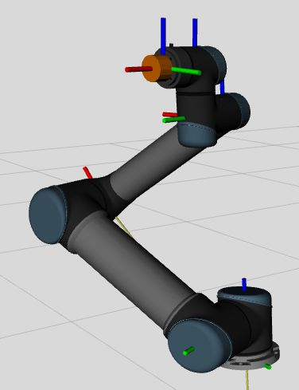
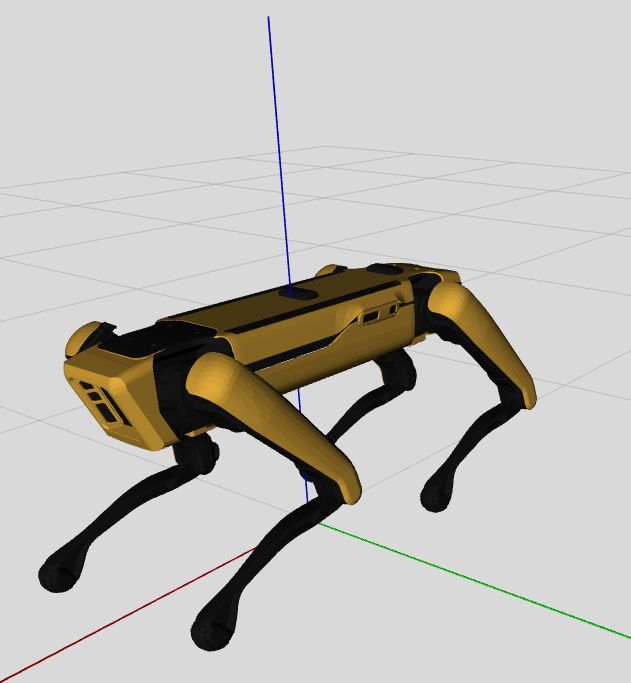
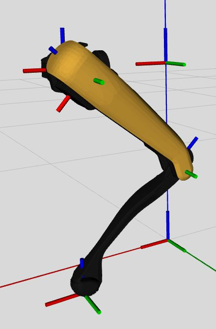

# ros2_descriptions

This package contains robot descriptions (URDF) properly organized to work with Gazebo (>= Harmonic) simulation and control using the `ros2_control` framework.
Descriptions were also formatted to easy the parsing by the [Pinocchio](https://github.com/stack-of-tasks/pinocchio) rigid body dynamics library.

Visualize the robot model with the following command:

```bash
ros2 launch ros2_descriptions view_robot.launch.py robot:=<robot_name>
```
Robot name options are:

| `ur5` | `spot` | `spot_leg` |
| :---: | :----: | :--------: |
| [](doc/ur5_manipulator.jpg) | [](doc/spot_boston_dynamics.jpg) | [](doc/spot_leg_frames_2.jpg) |
